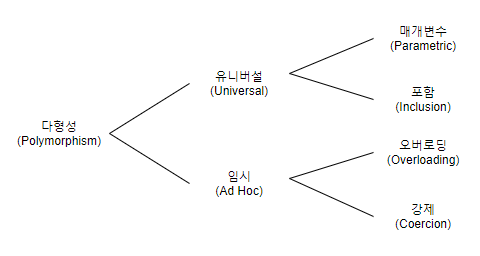
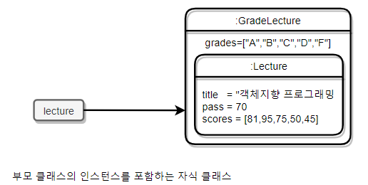
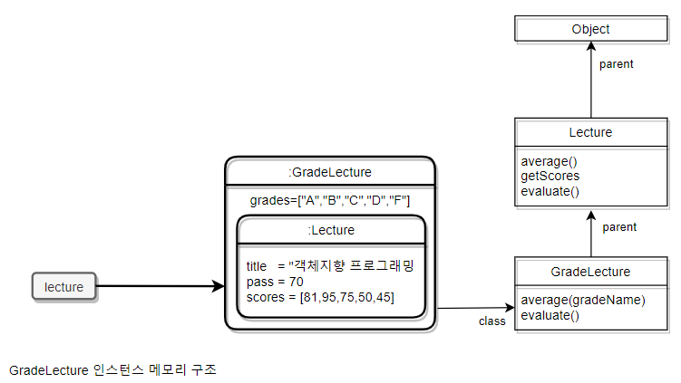
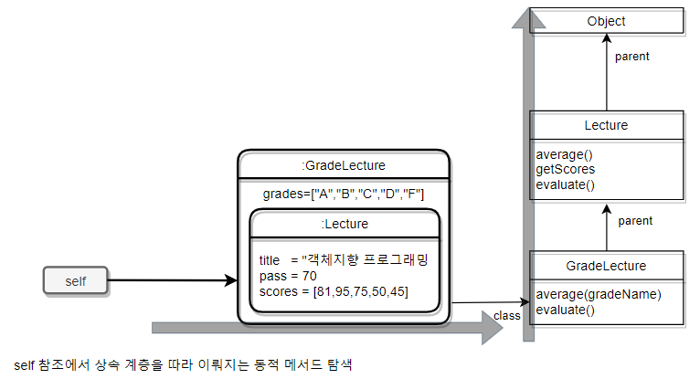

## 12. 다형성 

### 01 다형성
- 그리스어 `많은 Poly` 와 `형태 morph`의 합성어로 `많은 형태를 가질 수 있는 능력`
- 컴퓨터 과학에서는 하나의 추상 인터페이스에 대해 서로 다른 구현을 연결할 수 있는 능력으로 정의
- 객체지향 프로그래밍에서의 다형성

    - 오버로딩 다형성 : `하나의 클래스 안에 동일한 이름의 메서드가 존재하는 경우`
        - 서로 다른 타입의 파라미터를 가짐
        - 유사한 작업을 수행하는 메서드의 이름을 통일할 수 있다
        - ex) plus_money, plus_bigdecimal, plus_long => plus

    - 강제 다형성 : `언어가 지원하는 자동 타입변환 또는 사용자가 구현한 타입 변환을 이용해 동일한 연산자를 다양한 타입에 사용할 수 있는 방식`
        - ex) `+ 연산자` 숫자끼리 일땐 숫자, 문자가 포함되어 있으면 숫자는 강제로 문자로 변환
        - 오버로딩 다형성과 강제 다형성을 함께 사용하면 판단이 어려워진다. 
    
    - 매개변수 다형성 : `제네릭 프로그래밍과 관련이 높으며 변수나 메서드의 타입을 임시로 선언 후 사용시점에 구체적인 타입을 지정하는 방식`
        - C# 제네릭

    - 포함 다형성 : `메시지가 동일하더라도 수신한 객체의 타입에 따라 실제로 수행되는 행동이 달라지는 능력`
        - 서브타입 다형성이라고도 불림
        - 객체지향 프로그래밍에서 가장 널리 알려진 형태
        - 가장 일반적인 방법은 상속 (그래서 서브타입이라고..)
        - `상속의 진정한 목적은 코드 재사용이 아니라 다형성을 위한 서브타입 계층 구축`

- 이번 장에서는 다형성의 다양한 측면 중에서 포함 다형성에 관해 중점적으로 다룬다. 

### 02 상속의 양면성
- 객체지향 프로그램을 작성하기 위해서는 항상 데이터와 행동이라는 두 가지 관점을 함께 고려해야 한다. 
- 상속 역시 데이터관점, 행동관점의 상속이 있다. 
- 상속은 코드 재사용 목적이 아니며 다형성을 가능하게 하는 타입 계층을 구축하기 위한 것
- 상속의 매커니즘을 이해하는데 필요한 몇가지 개념
    - 업캐스팅
    - 동적 메서드 탐색
    - 동적 바인딩
    - self 참조
    - super 참조

#### 상속을 사용한 강의 평가

##### Lecture 클래스 살펴보기
- 수강생들의 성적을 계산하는 예제
    - 출력 목표 `Pass:3 Fail:2, A:1 B:1 C:1 D:0 F:2`
    - `Pass:3 Fail:2` 형식의 통계를 출력하는 Lecture 클래스 이미 존재.
    - Lecture를 재사용해 원하는 출력 기능을 구현
    ```java
        public class Lecture {
            private int pass;
            private String title;
            private List<Integer> scores = new ArrayList<>();

            public Lecture(String title, int pass, List<Integer> scores) {
                this.title = title;
                this.pass = pass;
                this.scores = scores;
            }

            public double average() {
                return scores.stream().mapToInt(Integer::intValue).average().orElse(0);
            }

            public List<Integer> getScores() {
                return Collections.unmodifiableList(scores);
            }

            public String evaluate() {
                return String.format("Pass:%d Fail:%d", passCount(), failCount());
            }

            private long passCount() {
                return scores.stream().filter(score -> score >= pass).count();
            }

            private long failCount() {
                return scores.size() - passCount();
            }
        }
    ```
##### 상속을 이용해 Lecture 클래스 재사용하기
- Grade 클래스 
    ```java
       public class Grade {
            private String name;
            private int upper,lower;

            private Grade(String name, int upper, int lower) {
                this.name = name;
                this.upper = upper;
                this.lower = lower;
            }

            public String getName() {
                return name;
            }

            public boolean isName(String name) {
                return this.name.equals(name);
            }

            public boolean include(int score) {
                return score >= lower && score <= upper;
            }
        }

    ```
- Lecture를 상속해 새 클래스 구현 -> GradeLecture
    - 인스턴스 변수 : grades(등급 리스트) 
    - evaluate 메서드 재정의
        ```java
        public class GradeLecture extends Lecture {
            private List<Grade> grades;

            public GradeLecture(String name, int pass, List<Grade> grades, List<Integer> scores) {
                super(name, pass, scores);
                this.grades = grades;
            }

            @Override
            public String evaluate() {
                return super.evaluate() + ", " + gradesStatistics();
            }

            private String gradesStatistics() {
                return grades.stream()
                        .map(grade -> format(grade))
                        .collect(joining(" "));
            }

            private String format(Grade grade) {
                return String.format("%s:%d", grade.getName(), gradeCount(grade));
            }

            private long gradeCount(Grade grade) {
                return getScores()
                            .stream()
                            .filter(grade::include)
                            .count();
            }
        }
        ```
    - GradeLecture와 Lecture에 구현된 두 evaluate 메서드의 시그니처가 동일하다.
        - 동일할 경우 자식클래스의 메서드가 우선순위가 더 높다. 
        - 부모클래스의 구현을 새로운 구현으로 대체하는 것을 `메서드 오버라이딩` 이라 한다. 
    - 부모 클래스에는 없던 새로운 메서드를 추가하는 것도 가능하다. 
         ```java
            public double average(String gradeName) {
                    return grades.stream()
                            .filter(each -> each.isName(gradeName))
                            .findFirst()
                            .map(this::gradeAverage)
                            .orElse(0d);
                }

            private double gradeAverage(Grade grade) {
                return getScores().stream()
                        .filter(grade::include)
                        .mapToInt(Integer::intValue)
                        .average()
                        .orElse(0);
            }
        ```
        - 이름은 동일 하지만 시그니처는 다른 메서드 : `메서드 오버로딩`
- 다시 한번 강조하지만 상속의 일차적인 목표는 `코드 재사용` 이 아니다

#### 데이터 관점의 상속
- 데이터 관점에서 상속은 자식 클래스의 인스턴스 안에 부모 클래스의 인스턴스를 포함하는 것으로 볼 수 있다. 


#### 행동 관점의 상속
- 상속은 부모 클래스가 정의한 일부 메서드를 자식 클래스의 메서드로 포함시키는 것을 의미
    - 실제로 클래스의 코드를 합치거나 복사하는 작업이 수행되는 것은 아니다. 
    - 런타임에 자식클래스에 정의되어 있지 않을 경우 부모클래스를 탐색한다. 
- 객체의 경우 서로 다른 상태를 저장할 수 있도록 독립적인 메모리를 할당 받아야 한다.
- 하지만 메서드의 경우 동일한 클래스의 인스턴스 끼리 공유가 가능하기에 한번만 메모리 로드 후 포인터를 갖는게 경제적

- 자식 클래스에서 부모 클래스로의 메서드 탐색이 가능하기 때문에 마치 부모 클래스의 복사본을 가진 것처럼 보인다.
- 각 객체에 포함된 class 포인터와 클래스에 포함된 parent 포인터를 조합하면 모든 부모 클래스에 접근하는 것이 가능하다. 


- 이해를 쉽도록 표현한 개념적인 그림. 구체적인 방법은 언어나 플랫폼에 따라 다르다. 


### 03 업캐스팅과 동적 바인딩

#### 같은 메시지, 다른 메서드
- 각 교수별로 강의에 대한 성적 통계 계산하는 기능 추가.
- Professor 클래스 추가 
    - 생성자에서 Lecture 클래스를 주입받음
    - compileStatistics()에서 Lecture.evaluate(), Lecture.average()를 사용
- 생성자에 Lecture 대신 자식 클래스인 GradeLecture 의 인스턴스를 전달해도 아무 문제 없다.
    - 업캐스팅: 부모 클래스의 타입으로 선언된 변수에 자식 클래스의 인스턴스를 할당하는 것이 가능
    - 동적 바인딩: 선언된 변수의 타입이 아니라 메세지를 수신하는 객체의 타입에 따라 실행되는 메서드가 결정된다. 객체지향 시스템이 적절한 메서드를 실행시점에 결정하기에 가능

#### 업캐스팅 
- 상속을 하게 되면 부모 클래스의 퍼블릭 인터페이스가 자식 클래스의 퍼블릭 인터페이스에 합쳐지기 때문에 부모대신 자식 클래스의 인스턴스 사용 가능
- 컴파일러는 명시적인 타입 변환 없이도 대체할 수 있게 허용한다. 
- `다운캐스팅`:  부모 클래스의 인스턴스를 자식 클래스 타입으로 변환하기 위해서는 명시적인 타입 캐스팅이 필요함 
- Lecture의 모든 자식 클래스는 Professor와 협력할 수 있는 무한한 확장 가능성을 가지기에 이 설계는 유연하며 확장이 용이하다. 

#### 동적 바인딩
- 정적 바인딩, 초기 바인딩, 컴파일 타입 바인딩 : 컴파일 타임에 호출할 함수를 결정하는 방식(전통적인 언어들)
- 동적 바인딩, 지연 바인딩 : 런타임에 호출할 함수를 결정(객체지향 언어)


### 04 동적 메서드 탐색과 다형성 

- 객체지향 시스템은 다음 규칙에 따라 실행할 메서드를 선택한다. 
    - 메시지를 수신한 객체는 자신을 생성한 클래스에서 메서드를 찾고 존재하면 실행 후 탐색을 종료한다. 
    - 찾지 못했다면 부모 클래스에서 메서드 탐색을 계속 하고 찾을 때까지 상속 계층을 따라 올라간다.
    - 상속 최상위 클래스에서도 발견하지 못하면 예외를 발생시킨다. 

- 객체가 메시지를 수신하면 컴파일러는 `Self참조` 라는 임시 변수를 자동으로 생성 후 메시지를 수신한 객체를 가리키도록 설정한다. (C#에선 this)
- 시스템은 앞에서 설명한 class 포인터, parent 포인터, self 참조를 조합해서 메서드를 동적 탐색한다. 



- 동적 메서드 탐색의 두 가지 원리
    - 자동적인 메시지 위임 : 자식 클래스에서 이해할 수 없는 메시지를 받은 경우 상속계층에 따라 부모클래스에게 위임 한다. 
    - 동적인 문맥 : 메시지 수신시 메서드의 결정은 런타임에 이뤄지며 self참조를 이용하여 탐색 경로가 결정된다. 

#### 자동적인 메시지 위임

- 메시지는 상속 계층을 따라 부모 클래스에게 자동으로 위임된다
    - 상속 계층을 정의하는 것은 메서드 탐색 경로를 정의하는 것과 동일하다
- 일부 언어들은 상속이 아닌 다른 방법을 이용해 메시지를 자동 위임할 수 있는 메커니즘을 제공
    - 루비의 모듈(module), 스몰토크와 스칼라의 트레이트(trait), 스위프트 프로토콜(protocol)과 확장(extension). (C# extension)

##### 메서드 오버라이딩
- Lecture 클래스의 evaluate 메서드 탐색과정
    - Lecture 안에 evaluate 메서드가 존재하기에 실행 후 탐색 종료
- GradeLecture 클래스의 evaluate 메서드 탐색과정
    - 부모클래스 Lecture.evaluate가 있지만 자식 클래스에서 먼저 탐색되기에 GradeLecture.evaluate가 먼저 실행 된다
    - 메서드 탐색 순서에 따라 자식 클래스에서 부모 클래스 메서드를 감추게 된다. 

##### 메서드 오버로딩
- 시그니처가 다르기 때문에 동일한 이름의 메서드가 공존하는 경우를 메서드 오버로딩이라 부른다. 
- 오버라이딩은 메서드를 감추지만 오버로딩은 공존한다. 
- 일부 언어에서는 상속 계층 사이의 메서드 오버로딩을 지원하지 않는다 (c++)
    - C++은 동일한 이름을 가진 메서드로 인한 혼란을 방지하기 위해 부모 클래스의 동일한 메서드를 전부 숨겨서 호출하지 못하게 한다. 이를 `이름 숨기기` 라고 부른다.
- `동적 메서드 탐색과 관련된 규칙은 언어마다 다를 수 있다.` 

#### 동적인 문맥
- 동일한 코드라도 self 참조가 무엇을 가리키는 가에 따라 메서드 탐색을 위한 상속 계층 범위가 동적으로 변한다. 
- Self 참조가 동적 문맥을 결정한다는 종종 사실은 어떤 메서드가 실행될지를 예상하기 어렵게 한다.
  - 대표적인 경우가 자신에게 다시 메시지를 전송하는 `self 전송` 이다. 
  ```java
        public class Lecture {
            public String stats() {
                return String.format("Title: %s, Evaluation Method: %s",
                        title, getEvaluationMethod());
            }

            public String getEvaluationMethod() {
                return "Pass or Fail";
            }
        }
  ```
  ```java
        public class GradeLecture extends Lecture {
            @Override
            public String getEvaluationMethod() {
                return "Grade";
            }
        }

  ```
  - 현재 클래스의 메서드를 호출 하는 것이 아니라 현재 객체의 메시지를 전송하는 것이다. 
  - GradeLecture의 stats()를 호출의 탐색 순서
    1. GradeLecture.stats 검색 
    2. 존재하지 않음 -> Lecture.stats 검색 & 실행
    3. Lecture.stats에서 getEvaluationMethod() 호출 
    4. `다시` GradeLecture에서 getEvaluationMethod 검색 & 실행
  - 결과적으로 Lecture.stats 와 GradeLecture.getEvaluationMethod 메서드의 실행 결과를 조합한 문자열이 반환된다. 
  - 이로 인해 최악의 경우 실제로 실행될 메서드를 이해하기 위해 상속 계층 전체를 훑어가며 코드를 이해해야 하는 상황이 발생할 수 있다. 
  
#### 이해할 수 없는 메시지

##### 정적 타입 언어와 이해할 수 없는 메시지
- 정적 타입 언어에서는 컴파일할 때 상속 계층 안의 클래스들이 메서지를 이해할 수 있는지 판단하기에 처리할 수 없을때 컴파일 에러를 발생시킨다. (c#은 정적타입 언어)

##### 동적 타입 언어와 이해할 수 없는 메시지
- 메서드 탐색 순서는 동일하나 컴파일 단계가 존재하지 않기 때문에 실제로 코드를 실행해 보기 전까진 메시지 처리 가능 여부를 알 수 없다. 
- 상속 계층 안에서 메시지를 처리할 수 없다면 최상위 클래스에 이르게 되고 최종적으로 예외가 던져진다. 
- 하지만 예외를 던지는 것 외에도 선택할 수 있는 방법이 하나 더 있다. 
  - 메서드를 처리할 수 없다는 메시지(doesNotUnderstand,method_missing)에 응답할 수 있는 메서드를 구현하는 것
- 이해할 수 없는 메시지를 처리할 수 있는 동적 타입 언어는 좀 더 순수한 관점에서 객체지향 패러다임을 구현한다고 볼 수 있다. 
- 동적 타입 언어는 이해할 수 없는 메시지를 처리할 수 있는 능력을 가짐으로써 메시지가 선언된 인터페이스와 메서드가 정의된 구현을 분리할 수 있다. 
- 하지만 이런 특성은 코드를 이해하고 수정하기 어렵게 만들고 디버깅 과정도 복잡하게 만들기도 한다. 
  
#### self 대 super
- 대부분의 객체지향 언어들은 자식 클래스에서 부모 클래스의 인스턴스 변수나 메서드에 접근하기 위해 사용할 수 있는 super 참조라는 변수를 제공한다 (c#은 base)
- super 참조를 이용해 `메서드를 호출`하지 않고 `메시지를 전송` 한다
- super를 통한 호출은 단순히 부모 클래스의 메서드를 호출하는 것이 아니라 더 상위에 위치한 조상 클래스의 메서드일 수도 있다.
- super의 정확한 의도는 `지금 이 클래스의 부모 클래스에서부터 메서드 탐색을 시작하세요` 다.
- self 전송에서 메시지 탐색을 시작하는 클래스는 미정이지만 super 전송에서는 컴파일 시점에 미리 결정해 놓을 수 있다. 
  - 언어의 특성에 따라 super 가 실행시점에 결정될 수도 있다 ex) 스칼라 트레이트

### 05 상속 대 위임

#### 위임과 self 참조

- Self 참조 
    - 메서드 탐색 중에는 자식 클래스의 인스턴스와 부모 클래스의 인스턴스가 동일한 self 참조를 공유하는 것으로 봐도 무방하다.    
    - 상속 계층을 구성하는 객체들 사이에서 self 참조를 공유하기 때문에 개념적으로 각 인스턴스에서 self 참조를 공유하는 변수를 포함하는 것처럼 표현할 수 있다. 
- 위임 
    - self와 super 직접 구현하고 상속관계를 표현
        ```ruby
        class Lecture
            def initialize(name, scores)
                @name = name
                @scores = scores
            end

            def stats(this)
                "Name: #{@name}, Evaluation Method: #{this.getEvaluationMethod()}"
            end

            def getEvaluationMethod()
                "Pass or Fail"
            end
        end
        ```
        ```ruby
        lecture = Lecture.new("OOP", [1,2,3])
        puts lecture.stats(lecture)
        = "Name: OOP, Evaluation Method: Pass or Fail"
        ```
        ```ruby
        class GradeLecture
            def initialize(name, canceled, scores)
                @parent = Lecture.new(name, scores)
                @canceled = canceled
            end

            def stats(this)
                @parent.stats(this)
            end

            def getEvaluationMethod()
                "Grade"
            end
        end
        ```
        ```ruby
        grade_lecture = GradeLecture.new("OOP", false, [1,2,3])
        puts grade_lecture.stats(grade_lecture)
        = "Name: OOP, Evaluation Method: Grade"
        ```
    - GradeLecture.stats 메서드는 직접 처리하지 않고 Lecture.stats 메서드에 요청을 전달한다.
    - 이처럼 자신이 수신한 메시지를 다른 객체에게 동일하게 전달, 처리를 요청하는 것을 `위임` 이라 한다. 
- 상속은 동적으로 메서드를 탐색하기 위해 Self 참조를 전달한다. 그리고 객체지향 언어에서는 이 객체들 사이에 메시지를 전달하는 과정이 자동으로 이뤄지며 이를 `자동적인 메시지 위임`이라 한다. 

#### 프로토타입 기반의 객체지향 언어
- `클래스가 존재하지 않고 오직 객체만 존재하는` 프로토타입 기반의 객체지향 언어에서 상속을 구현하는 유일한 방법은 객체 사이의 위임을 이용하는 것
- 프로토타입 기반의 객체지향 언어들 역시 위임을 이용해 객체 사이의 self를 자동으로 전달한다. 
- javascript 예제
    - 자바스크립트의 모든 객체는 다른 객체를 가리키는 용도의 prototype이라는 이름의 링크를 가짐
        - 앞에 ruby 예제에서 봤던 @parent와 동일한 것으로 봐도 무방
        - 차이점이라면 self를 직접 전달하거나 메시지 포워딩을 직접 구현할 필요가 없다
    - 자바스크립트 인스턴스는 메시지를 수신하면 수신한 객체의 prototype 먼저 적절한 메시지를 검사한다. 존재 하지 않는다면 prototype이 가리키는 객체를 따라 메시지 처리를 자동으로 위임한다. 상속과 유사
    - prototpye을 따로 할당하지 않으면 최상의 Object를 가르킨다. 
    - 메서드를 탐색하는 과정은 클래스 기반 언어의 상속과 거의 동일하다
        ```javascript
            function Lecture(name, scores) {
                this.name = name;
                this.scores = scores;
                }

            Lecture.prototype.stats = function() {
                return "Name: "+ this.name + ", Evaluation Method: "+ this.getEvaluationMethod();
            }

            Lecture.prototype.getEvaluationMethod = function() {
                return "Pass or Fail"
            }

            function GradeLecture(name, canceled, scores) {
                Lecture.call(this, name, scores);
                this.canceled = canceled;
            }

            GradeLecture.prototype = new Lecture();

            GradeLecture.prototype.constructor = GradeLecture;

            GradeLecture.prototype.getEvaluationMethod = function() {
                return "Grade"
            }
        ```
    - 차이가 있다면 동적인 객체 사이의 위임을 통해 상속을 구현하고 있다. 

- 객체지향 패러다임에서 클래스가 필수요소가 아니라는 점을 보여준다.
- 상속 이외의 방법으로도 다형성을 구현할 수 있다는 사실을 보여준다. 

` 중요한 것은 클래스 기반의 상속과 객체 기반의 위임 사이에 기본 개념과 메커니즘을 공유한다는 점 `
    

        

